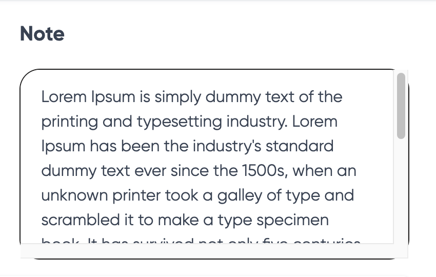

# Understanding Scrollbar Visibility

When doing web programming in a context where scroll might be expected, you may
see some surprising behavior in the scrollable HTML: an inexplicable gray bar
on the bottom or right (or both) of the element. Something like this:

One culprit, on Mac, is the user's scrollbar setting.

One can set their Mac OS to always show scrollbars when they are present. While
this might aid in your accessibility or user experience, if you aren't aware of
it, it can also make scrollable elements look weird.

Under "Settings > Appearance > Show scroll bars" you can adjust this setting.
